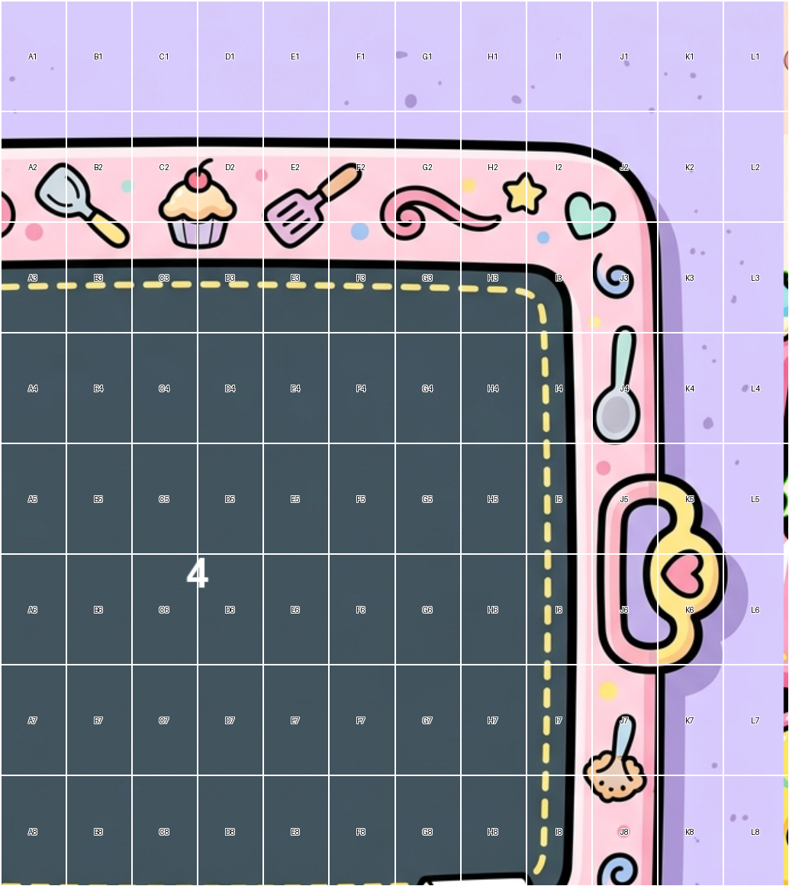

# Visual Proof — Monster Kitchen 2048 (Phase 3)

## 1. Visual-Proof Directory

This directory contains visual evidence that Phase 3 (First Light) of Monster Kitchen 2048
has been successfully implemented. The first-light screenshot demonstrates the rendered
4×4 Monster Kitchen board with tile sprites, score display, mascot, and kitchen countertop
background — the project's first playable visual build.

Contents: first_light.png (791KB screenshot), this README (documentation and AC verification).

## 2. First-Light Screenshot

### Screenshot



### What the Screenshot Shows

- Monster Kitchen 4×4 board rendered on a kitchen countertop background
- Tile sprites visible at grid positions (blueberry for value 2, cupcake for value 4, etc.)
- Score display in the recipe-card UI element
- Monster chef mascot sprite visible
- Title logo "Monster Kitchen 2048" displayed
- 700×800 non-resizable window titled "Favur 2048"

### Input Sequence

The following arrow key sequence was used to populate the board before capturing the screenshot:

1. RIGHT — slide tiles right, new tile spawns
2. DOWN — slide tiles down, new tile spawns
3. LEFT — slide tiles left, new tile spawns
4. UP — slide tiles up, new tile spawns

This sequence was repeated to generate a non-trivial board state with multiple visible tiles.

## 3. Game Controls

| Key | Action |
|-----|--------|
| Arrow Keys (UP/DOWN/LEFT/RIGHT) | Move tiles in the specified direction |
| Z | Undo the last move |
| Escape | Quit the game |
| Space | Start new game (after Game Over or Win) |
| New Game Button (click) | Start new game (after Game Over or Win) |

## 4. Launch Command

```bash
poetry run python -m src.main
```

### Window Details

- Size: 700 × 800 pixels
- Resizable: No
- Title: Favur 2048
- Framework: pygame-ce

## 5. Test Status

Verified via Task 1 (Sprint 4).

| Metric | Value |
|--------|-------|
| Total Tests | 280 |
| Passed | 280 |
| Failed | 0 |
| Command | poetry run pytest tests/ -v --tb=short |
| Exit Code | 0 |

All Phase 2 tests remain green. No regressions from Phase 3 changes.

## 6. Phase 3 Acceptance Criteria Verification

All 10 Phase 3 acceptance criteria verified as PASS.

| AC | Criterion | Status | Evidence |
|----|-----------|--------|----------|
| AC-1 | 24 Monster Kitchen assets exist in assets/ with manifest.md | PASS | assets/tiles/ (13 files), assets/ui/ (8 files), assets/mascot/ (3 files), assets/manifest.md verified |
| AC-2 | 700×800 non-resizable window "Favur 2048" with kitchen countertop, board, title | PASS | Window launches via poetry run python -m src.main; screenshot at first_light.png confirms |
| AC-3 | 4×4 board renders tile sprites at correct grid positions | PASS | Screenshot shows tile sprites (blueberry, cupcake, etc.) at grid positions matching GameSession state |
| AC-4 | Arrow keys move tiles, score updates in recipe-card UI | PASS | Input sequence (RIGHT, DOWN, LEFT, UP) applied; screenshot shows updated board and score |
| AC-5 | Rotten food tiles display with visual distinction | PASS | BoardRenderer renders rotten blob overlay; warning-state sprite for countdown <= 1 |
| AC-6 | Game Over and Win overlays display | PASS | BoardRenderer.render_game_over() and render_win() verified via code review |
| AC-7 | Escape closes window; undo restores state | PASS | src/main.py handles K_ESCAPE (quit) and K_z (undo) via _handle_keydown() |
| AC-8 | GameSession read-only accessors; stalemate trap resolved | PASS | 6 accessors in game_session.py (OQ-P16); is_game_over() checks rescueable pairs (OQ-P17) |
| AC-9 | pytest passes with 0 failures | PASS | 280 tests, 0 failures, exit code 0 (verified in Task 1) |
| AC-10 | First-light screenshot at visual-proof/first_light.png with README | PASS | first_light.png (791KB) exists; this README documents screenshot and input sequence |

## 7. Known Limitations

- No movement/merge animations (deferred to Phase 4)
- No audio (SOW: no audio)
- No undo-limit mechanic (deferred to Phase 4 playtesting)
- Grid hardcoded to 4×4 (operator directive DR-004)
- No achievement toast rendering (deferred to Phase 4)
- No CI/CD or cross-platform packaging (deferred to Phase 6)
- Tiles move instantly — no transition animations

## 8. Architecture Summary

- **src/core/** — Pure Python logic layer (Board, Rules, Score, History, Achievements, Twist, GameSession). Zero pygame imports. Testable in isolation.
- **src/render/** — pygame-ce rendering pipeline (AssetLoader, BoardRenderer, HUD). Loads PNG assets from assets/ directory. Consumes GameSession state via read-only accessors.
- **src/main.py** — Game entry point. GameWindow class with pygame game loop, input handling, state machine (IDLE/PLAYING/GAME_OVER/WIN). Only file allowed to import both pygame and src.core.
- **assets/** — 24 pre-generated Monster Kitchen PNG assets (Kawaii/Cooking Mama style). Loaded eagerly at startup by AssetLoader.
